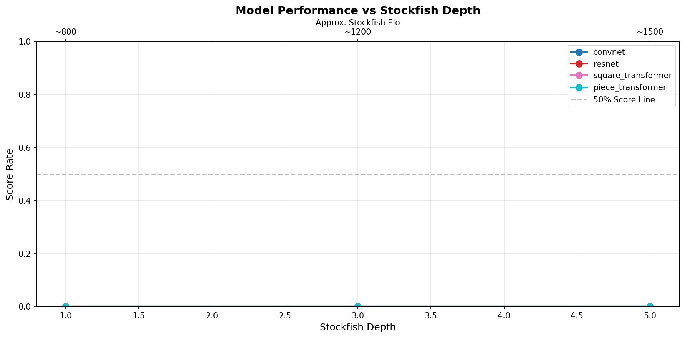
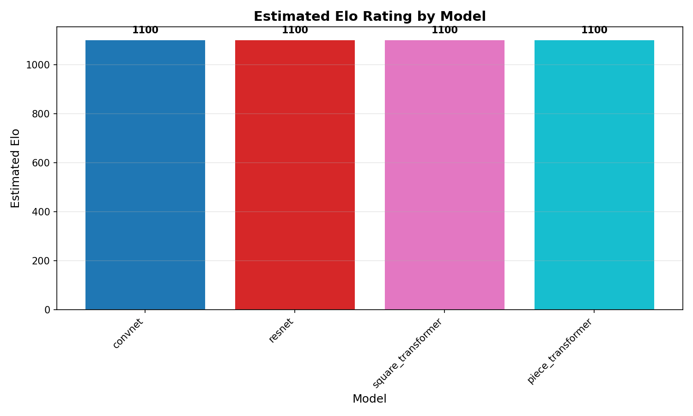
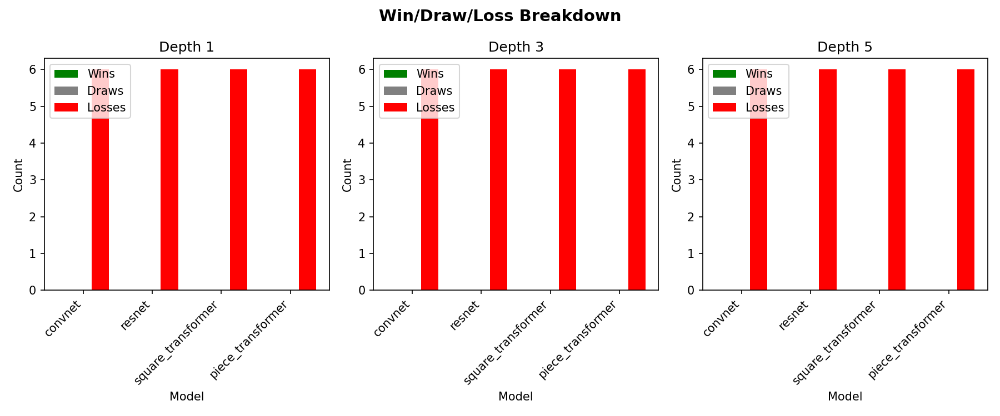

# Chess Model Benchmark Report

**Generated:** 2026-01-26 23:27:00

## Estimated Elo Ratings

| Model | Estimated Elo | Rank |
|-------|---------------|------|
| convnet | **1100** | #1 |
| resnet | **1100** | #2 |
| square_transformer | **1100** | #3 |
| piece_transformer | **1100** | #4 |

## Performance vs Stockfish Depth

| Model | D1 || D3 || D5 |
|---|---|---|---|
| convnet | 0.0% | 0.0% | 0.0% |
| resnet | 0.0% | 0.0% | 0.0% |
| square_transformer | 0.0% | 0.0% | 0.0% |
| piece_transformer | 0.0% | 0.0% | 0.0% |

## Detailed Results

### convnet

**Estimated Elo:** 1100

| Depth | SF Elo | W | D | L | Score | Rate |
|-------|--------|---|---|---|-------|------|
| 1 | ~800 | 0 | 0 | 6 | 0.0/6 | 0.0% |
| 3 | ~1200 | 0 | 0 | 6 | 0.0/6 | 0.0% |
| 5 | ~1500 | 0 | 0 | 6 | 0.0/6 | 0.0% |

### resnet

**Estimated Elo:** 1100

| Depth | SF Elo | W | D | L | Score | Rate |
|-------|--------|---|---|---|-------|------|
| 1 | ~800 | 0 | 0 | 6 | 0.0/6 | 0.0% |
| 3 | ~1200 | 0 | 0 | 6 | 0.0/6 | 0.0% |
| 5 | ~1500 | 0 | 0 | 6 | 0.0/6 | 0.0% |

### square_transformer

**Estimated Elo:** 1100

| Depth | SF Elo | W | D | L | Score | Rate |
|-------|--------|---|---|---|-------|------|
| 1 | ~800 | 0 | 0 | 6 | 0.0/6 | 0.0% |
| 3 | ~1200 | 0 | 0 | 6 | 0.0/6 | 0.0% |
| 5 | ~1500 | 0 | 0 | 6 | 0.0/6 | 0.0% |

### piece_transformer

**Estimated Elo:** 1100

| Depth | SF Elo | W | D | L | Score | Rate |
|-------|--------|---|---|---|-------|------|
| 1 | ~800 | 0 | 0 | 6 | 0.0/6 | 0.0% |
| 3 | ~1200 | 0 | 0 | 6 | 0.0/6 | 0.0% |
| 5 | ~1500 | 0 | 0 | 6 | 0.0/6 | 0.0% |

## Visualizations

## Methodology

- Models play alternating colors (white/black) for fairness
- Greedy move selection (temperature=0) for deterministic play
- Games capped at 200 moves
- Elo estimated from crossover point (50% score rate)
