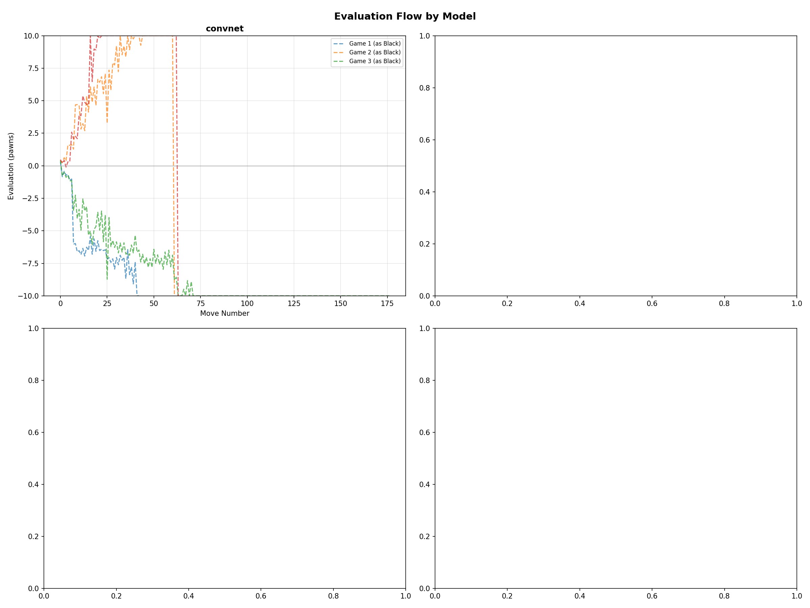
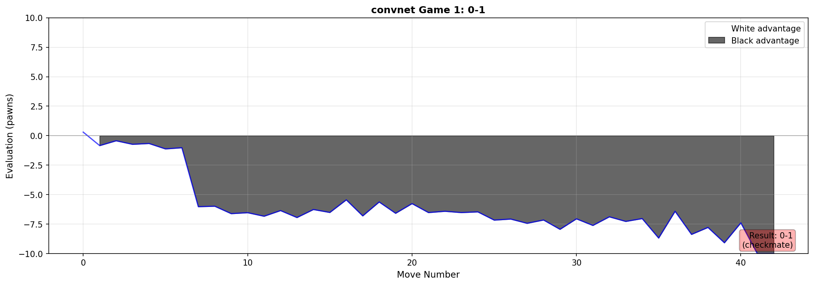
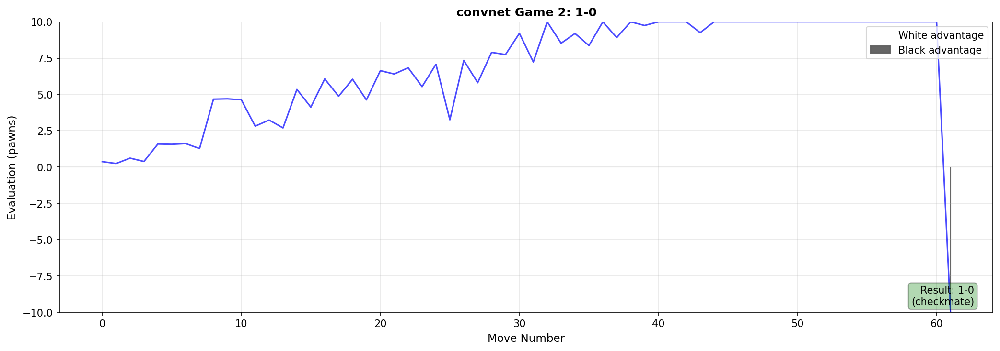
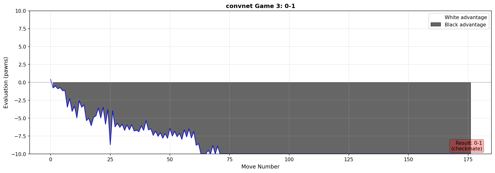
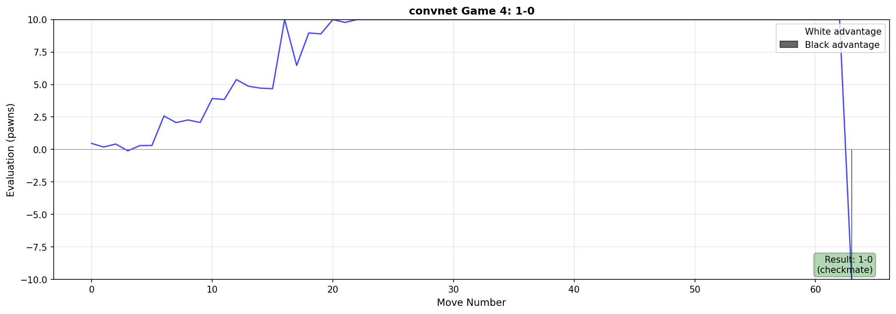

# Detailed Chess Model Benchmark

**Date:** 2026-01-30 19:34
**Opponent:** Stockfish depth 1
**Evaluation Depth:** 18

## Results Summary

| Model | W | D | L | Score |
|-------|---|---|---|-------|
| convnet | 0 | 0 | 4 | 0.0/4 |

## Game Files

- **Combined PGN:** [all_games.pgn](all_games.pgn) - Open in Lichess, Chess.com, or any chess software
- **Individual PGNs:** `pgn/` directory

## Evaluation Charts

### Individual Game Charts

#### convnet

## How to View Games

1. **Lichess:** Go to lichess.org/paste and paste the PGN content
2. **Chess.com:** Use chess.com/analysis and import PGN
3. **Desktop Apps:** Open with ChessBase, Arena, SCID, or Lucas Chess
4. **Command Line:** Use `python-chess` to parse the PGN files
