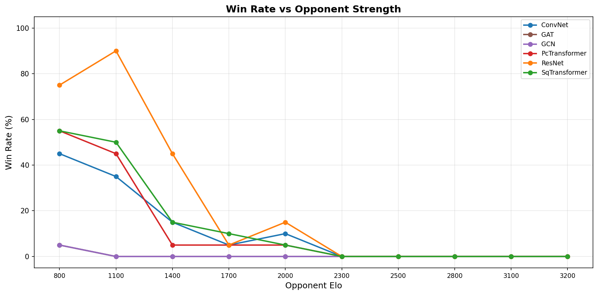
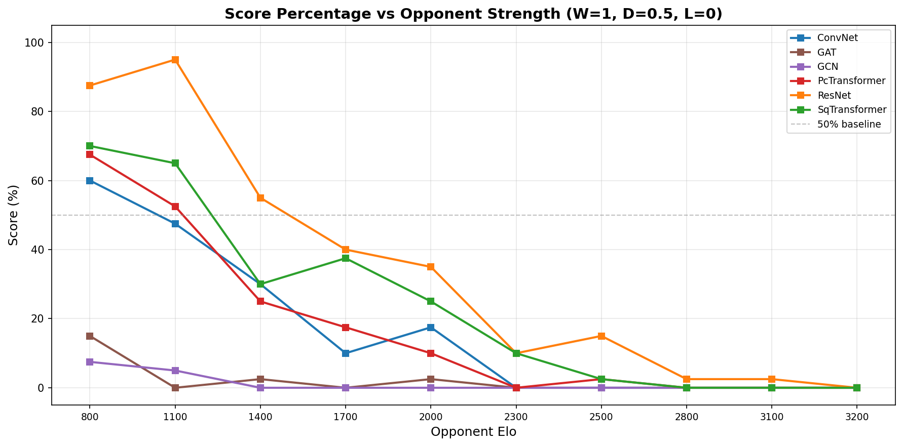
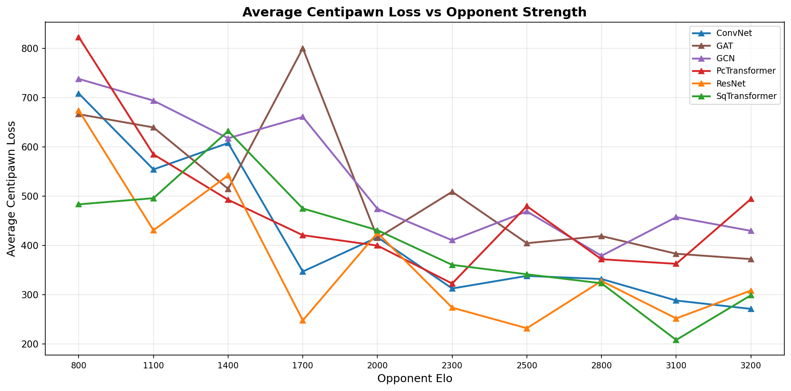
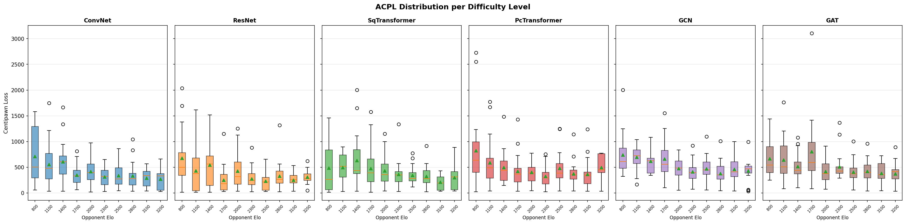
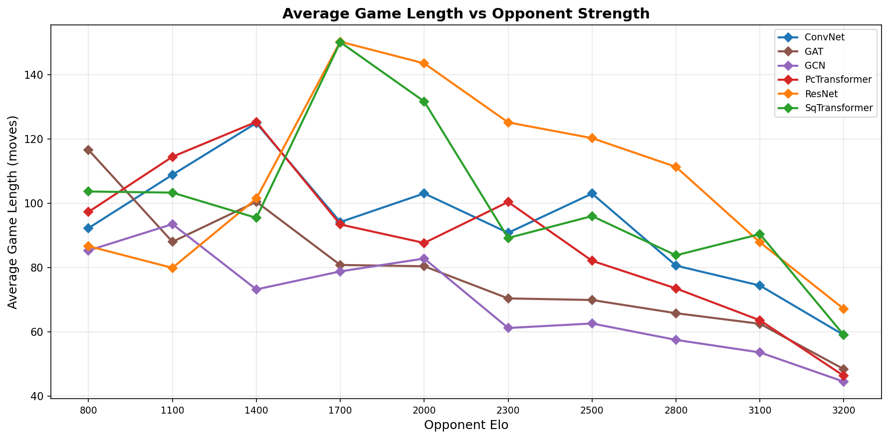
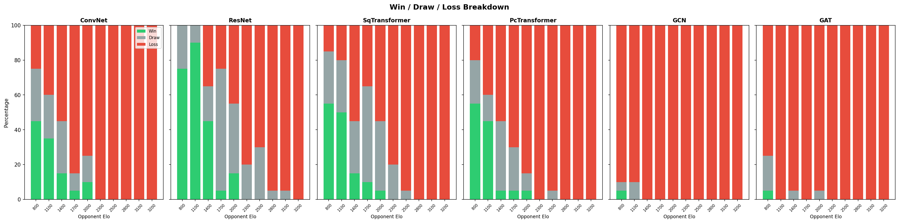
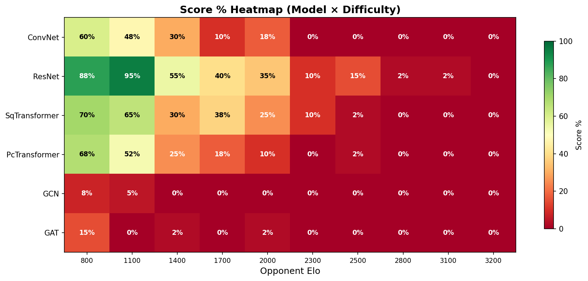

# Comprehensive Model Evaluation Report

**Date:** 2026-02-14 19:51
**Checkpoint source:** runs/50_10M
**Evaluation depth:** 18
**Models tested:** 6
**Difficulty levels:** 10

## Difficulty Levels

| Level | Skill | Depth | ~Elo |
|-------|-------|-------|------|
| Beginner-800 | 0 | 1 | 800 |
| Novice-1100 | 1 | 2 | 1100 |
| Casual-1400 | 3 | 3 | 1400 |
| Club-1700 | 5 | 5 | 1700 |
| Strong-2000 | 7 | 5 | 2000 |
| Expert-2300 | 9 | 8 | 2300 |
| Master-2500 | 11 | 8 | 2500 |
| IM-2800 | 14 | 10 | 2800 |
| GM-3100 | 17 | 13 | 3100 |
| Full-3200 | 20 | 18 | 3200 |

## Score Percentage Summary

| Model | 800 | 1100 | 1400 | 1700 | 2000 | 2300 | 2500 | 2800 | 3100 | 3200 |
|-------|-------|-------|-------|-------|-------|-------|-------|-------|-------|-------|
| ConvNet | 60% | 48% | 30% | 10% | 18% | 0% | 0% | 0% | 0% | 0% |
| ResNet | 88% | 95% | 55% | 40% | 35% | 10% | 15% | 2% | 2% | 0% |
| SqTransformer | 70% | 65% | 30% | 38% | 25% | 10% | 2% | 0% | 0% | 0% |
| PcTransformer | 68% | 52% | 25% | 18% | 10% | 0% | 2% | 0% | 0% | 0% |
| GCN | 8% | 5% | 0% | 0% | 0% | 0% | 0% | 0% | 0% | 0% |
| GAT | 15% | 0% | 2% | 0% | 2% | 0% | 0% | 0% | 0% | 0% |

## Average Centipawn Loss

| Model | 800 | 1100 | 1400 | 1700 | 2000 | 2300 | 2500 | 2800 | 3100 | 3200 |
|-------|-------|-------|-------|-------|-------|-------|-------|-------|-------|-------|
| ConvNet | 708 | 554 | 608 | 347 | 416 | 312 | 338 | 332 | 288 | 271 |
| ResNet | 674 | 431 | 542 | 248 | 425 | 273 | 232 | 328 | 252 | 308 |
| SqTransformer | 483 | 496 | 632 | 475 | 431 | 360 | 341 | 323 | 208 | 299 |
| PcTransformer | 823 | 585 | 493 | 421 | 399 | 322 | 480 | 372 | 362 | 494 |
| GCN | 738 | 694 | 618 | 661 | 474 | 410 | 469 | 379 | 457 | 429 |
| GAT | 666 | 640 | 515 | 800 | 415 | 509 | 404 | 419 | 383 | 372 |

## Win/Draw/Loss Detail

### ConvNet

| Opponent Elo | W | D | L | Score % | Avg ACPL | Avg Length |
|-------------|---|---|---|---------|----------|------------|
| 800 | 9 | 6 | 5 | 60% | 708 | 92 |
| 1100 | 7 | 5 | 8 | 48% | 554 | 109 |
| 1400 | 3 | 6 | 11 | 30% | 608 | 125 |
| 1700 | 1 | 2 | 17 | 10% | 347 | 94 |
| 2000 | 2 | 3 | 15 | 18% | 416 | 103 |
| 2300 | 0 | 0 | 20 | 0% | 312 | 91 |
| 2500 | 0 | 0 | 20 | 0% | 338 | 103 |
| 2800 | 0 | 0 | 20 | 0% | 332 | 81 |
| 3100 | 0 | 0 | 20 | 0% | 288 | 74 |
| 3200 | 0 | 0 | 20 | 0% | 271 | 59 |

### ResNet

| Opponent Elo | W | D | L | Score % | Avg ACPL | Avg Length |
|-------------|---|---|---|---------|----------|------------|
| 800 | 15 | 5 | 0 | 88% | 674 | 87 |
| 1100 | 18 | 2 | 0 | 95% | 431 | 80 |
| 1400 | 9 | 4 | 7 | 55% | 542 | 101 |
| 1700 | 1 | 14 | 5 | 40% | 248 | 150 |
| 2000 | 3 | 8 | 9 | 35% | 425 | 144 |
| 2300 | 0 | 4 | 16 | 10% | 273 | 125 |
| 2500 | 0 | 6 | 14 | 15% | 232 | 120 |
| 2800 | 0 | 1 | 19 | 2% | 328 | 111 |
| 3100 | 0 | 1 | 19 | 2% | 252 | 88 |
| 3200 | 0 | 0 | 20 | 0% | 308 | 67 |

### SqTransformer

| Opponent Elo | W | D | L | Score % | Avg ACPL | Avg Length |
|-------------|---|---|---|---------|----------|------------|
| 800 | 11 | 6 | 3 | 70% | 483 | 104 |
| 1100 | 10 | 6 | 4 | 65% | 496 | 103 |
| 1400 | 3 | 6 | 11 | 30% | 632 | 95 |
| 1700 | 2 | 11 | 7 | 38% | 475 | 150 |
| 2000 | 1 | 8 | 11 | 25% | 431 | 132 |
| 2300 | 0 | 4 | 16 | 10% | 360 | 89 |
| 2500 | 0 | 1 | 19 | 2% | 341 | 96 |
| 2800 | 0 | 0 | 20 | 0% | 323 | 84 |
| 3100 | 0 | 0 | 20 | 0% | 208 | 90 |
| 3200 | 0 | 0 | 20 | 0% | 299 | 59 |

### PcTransformer

| Opponent Elo | W | D | L | Score % | Avg ACPL | Avg Length |
|-------------|---|---|---|---------|----------|------------|
| 800 | 11 | 5 | 4 | 68% | 823 | 97 |
| 1100 | 9 | 3 | 8 | 52% | 585 | 114 |
| 1400 | 1 | 8 | 11 | 25% | 493 | 125 |
| 1700 | 1 | 5 | 14 | 18% | 421 | 93 |
| 2000 | 1 | 2 | 17 | 10% | 399 | 88 |
| 2300 | 0 | 0 | 20 | 0% | 322 | 100 |
| 2500 | 0 | 1 | 19 | 2% | 480 | 82 |
| 2800 | 0 | 0 | 20 | 0% | 372 | 74 |
| 3100 | 0 | 0 | 20 | 0% | 362 | 64 |
| 3200 | 0 | 0 | 20 | 0% | 494 | 46 |

### GCN

| Opponent Elo | W | D | L | Score % | Avg ACPL | Avg Length |
|-------------|---|---|---|---------|----------|------------|
| 800 | 1 | 1 | 18 | 8% | 738 | 85 |
| 1100 | 0 | 2 | 18 | 5% | 694 | 94 |
| 1400 | 0 | 0 | 20 | 0% | 618 | 73 |
| 1700 | 0 | 0 | 20 | 0% | 661 | 79 |
| 2000 | 0 | 0 | 20 | 0% | 474 | 83 |
| 2300 | 0 | 0 | 20 | 0% | 410 | 61 |
| 2500 | 0 | 0 | 20 | 0% | 469 | 63 |
| 2800 | 0 | 0 | 20 | 0% | 379 | 58 |
| 3100 | 0 | 0 | 20 | 0% | 457 | 54 |
| 3200 | 0 | 0 | 20 | 0% | 429 | 44 |

### GAT

| Opponent Elo | W | D | L | Score % | Avg ACPL | Avg Length |
|-------------|---|---|---|---------|----------|------------|
| 800 | 1 | 4 | 15 | 15% | 666 | 117 |
| 1100 | 0 | 0 | 20 | 0% | 640 | 88 |
| 1400 | 0 | 1 | 19 | 2% | 515 | 100 |
| 1700 | 0 | 0 | 20 | 0% | 800 | 81 |
| 2000 | 0 | 1 | 19 | 2% | 415 | 80 |
| 2300 | 0 | 0 | 20 | 0% | 509 | 70 |
| 2500 | 0 | 0 | 20 | 0% | 404 | 70 |
| 2800 | 0 | 0 | 20 | 0% | 419 | 66 |
| 3100 | 0 | 0 | 20 | 0% | 383 | 62 |
| 3200 | 0 | 0 | 20 | 0% | 372 | 48 |

## Figures

### Win Rate vs Opponent Strength

### Score % vs Opponent Strength

### Average Centipawn Loss

### ACPL Distribution Boxplots

### Average Game Length

### Win/Draw/Loss Stacked Bars

### Score % Heatmap

