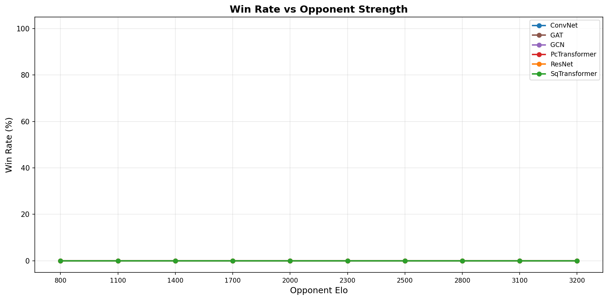
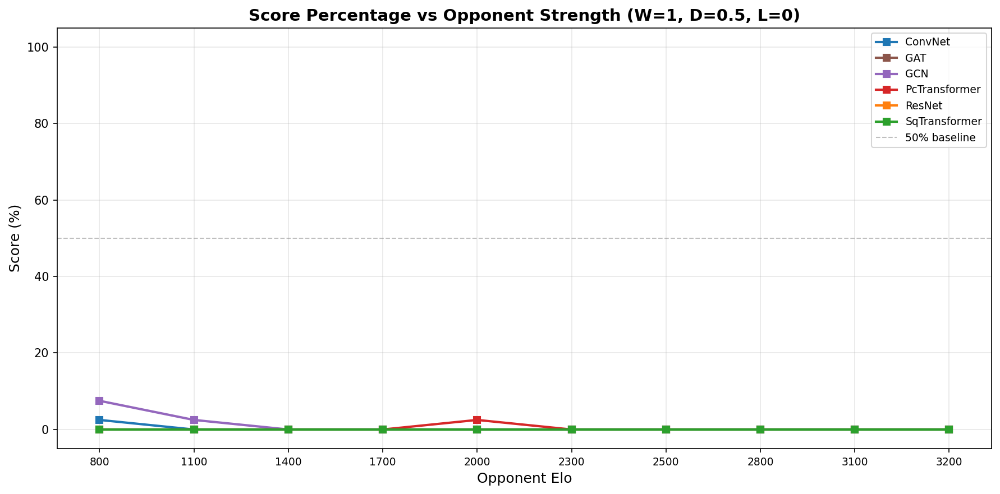
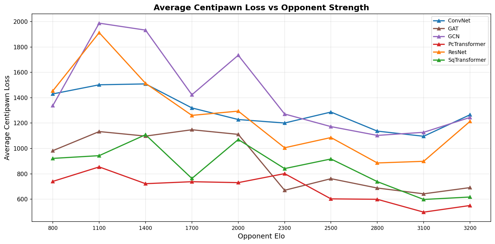
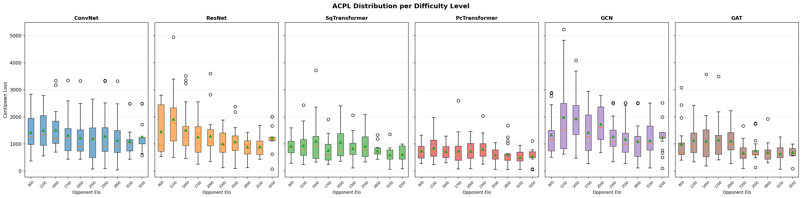
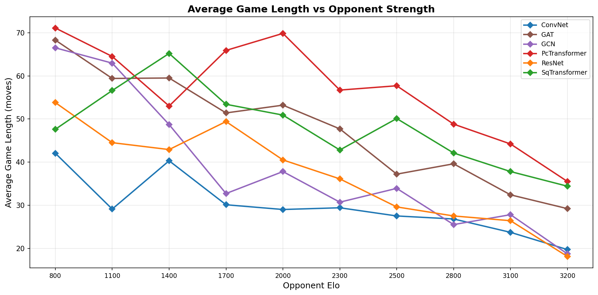
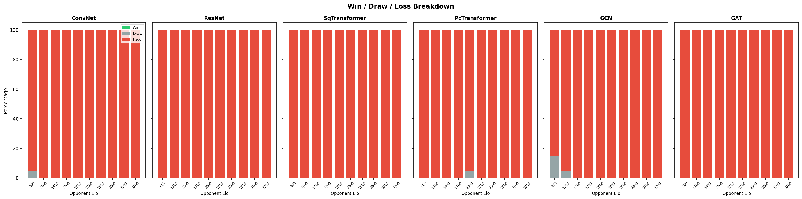
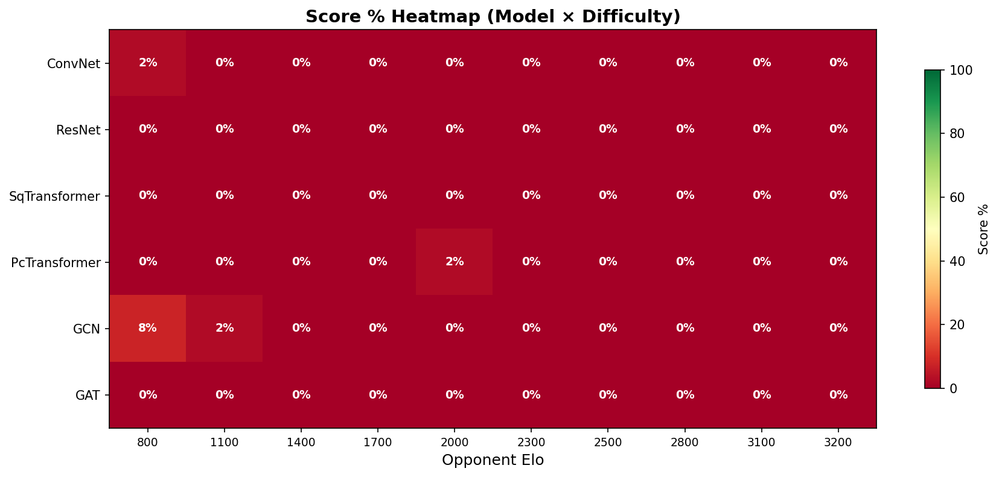

# Comprehensive Model Evaluation Report

**Date:** 2026-02-15 20:25
**Checkpoint source:** runs/50_10M
**Evaluation depth:** 18
**Models tested:** 6
**Difficulty levels:** 10

## Difficulty Levels

| Level | Skill | Depth | ~Elo |
|-------|-------|-------|------|
| Beginner-800 | 0 | 1 | 800 |
| Novice-1100 | 1 | 2 | 1100 |
| Casual-1400 | 3 | 3 | 1400 |
| Club-1700 | 5 | 5 | 1700 |
| Strong-2000 | 7 | 5 | 2000 |
| Expert-2300 | 9 | 8 | 2300 |
| Master-2500 | 11 | 8 | 2500 |
| IM-2800 | 14 | 10 | 2800 |
| GM-3100 | 17 | 13 | 3100 |
| Full-3200 | 20 | 18 | 3200 |

## Score Percentage Summary

| Model | 800 | 1100 | 1400 | 1700 | 2000 | 2300 | 2500 | 2800 | 3100 | 3200 |
|-------|-------|-------|-------|-------|-------|-------|-------|-------|-------|-------|
| ConvNet | 2% | 0% | 0% | 0% | 0% | 0% | 0% | 0% | 0% | 0% |
| ResNet | 0% | 0% | 0% | 0% | 0% | 0% | 0% | 0% | 0% | 0% |
| SqTransformer | 0% | 0% | 0% | 0% | 0% | 0% | 0% | 0% | 0% | 0% |
| PcTransformer | 0% | 0% | 0% | 0% | 2% | 0% | 0% | 0% | 0% | 0% |
| GCN | 8% | 2% | 0% | 0% | 0% | 0% | 0% | 0% | 0% | 0% |
| GAT | 0% | 0% | 0% | 0% | 0% | 0% | 0% | 0% | 0% | 0% |

## Average Centipawn Loss

| Model | 800 | 1100 | 1400 | 1700 | 2000 | 2300 | 2500 | 2800 | 3100 | 3200 |
|-------|-------|-------|-------|-------|-------|-------|-------|-------|-------|-------|
| ConvNet | 1430 | 1502 | 1509 | 1319 | 1228 | 1200 | 1287 | 1136 | 1096 | 1266 |
| ResNet | 1454 | 1913 | 1513 | 1261 | 1294 | 1005 | 1086 | 886 | 898 | 1213 |
| SqTransformer | 921 | 943 | 1108 | 763 | 1070 | 841 | 917 | 738 | 598 | 617 |
| PcTransformer | 740 | 854 | 722 | 738 | 730 | 801 | 602 | 599 | 498 | 550 |
| GCN | 1338 | 1988 | 1933 | 1423 | 1735 | 1272 | 1172 | 1103 | 1127 | 1245 |
| GAT | 982 | 1133 | 1097 | 1147 | 1111 | 670 | 762 | 688 | 642 | 691 |

## Win/Draw/Loss Detail

### ConvNet

| Opponent Elo | W | D | L | Score % | Avg ACPL | Avg Length |
|-------------|---|---|---|---------|----------|------------|
| 800 | 0 | 1 | 19 | 2% | 1430 | 42 |
| 1100 | 0 | 0 | 20 | 0% | 1502 | 29 |
| 1400 | 0 | 0 | 20 | 0% | 1509 | 40 |
| 1700 | 0 | 0 | 20 | 0% | 1319 | 30 |
| 2000 | 0 | 0 | 20 | 0% | 1228 | 29 |
| 2300 | 0 | 0 | 20 | 0% | 1200 | 29 |
| 2500 | 0 | 0 | 20 | 0% | 1287 | 28 |
| 2800 | 0 | 0 | 20 | 0% | 1136 | 27 |
| 3100 | 0 | 0 | 20 | 0% | 1096 | 24 |
| 3200 | 0 | 0 | 20 | 0% | 1266 | 20 |

### ResNet

| Opponent Elo | W | D | L | Score % | Avg ACPL | Avg Length |
|-------------|---|---|---|---------|----------|------------|
| 800 | 0 | 0 | 20 | 0% | 1454 | 54 |
| 1100 | 0 | 0 | 20 | 0% | 1913 | 44 |
| 1400 | 0 | 0 | 20 | 0% | 1513 | 43 |
| 1700 | 0 | 0 | 20 | 0% | 1261 | 49 |
| 2000 | 0 | 0 | 20 | 0% | 1294 | 40 |
| 2300 | 0 | 0 | 20 | 0% | 1005 | 36 |
| 2500 | 0 | 0 | 20 | 0% | 1086 | 30 |
| 2800 | 0 | 0 | 20 | 0% | 886 | 28 |
| 3100 | 0 | 0 | 20 | 0% | 898 | 26 |
| 3200 | 0 | 0 | 20 | 0% | 1213 | 18 |

### SqTransformer

| Opponent Elo | W | D | L | Score % | Avg ACPL | Avg Length |
|-------------|---|---|---|---------|----------|------------|
| 800 | 0 | 0 | 20 | 0% | 921 | 48 |
| 1100 | 0 | 0 | 20 | 0% | 943 | 57 |
| 1400 | 0 | 0 | 20 | 0% | 1108 | 65 |
| 1700 | 0 | 0 | 20 | 0% | 763 | 53 |
| 2000 | 0 | 0 | 20 | 0% | 1070 | 51 |
| 2300 | 0 | 0 | 20 | 0% | 841 | 43 |
| 2500 | 0 | 0 | 20 | 0% | 917 | 50 |
| 2800 | 0 | 0 | 20 | 0% | 738 | 42 |
| 3100 | 0 | 0 | 20 | 0% | 598 | 38 |
| 3200 | 0 | 0 | 20 | 0% | 617 | 34 |

### PcTransformer

| Opponent Elo | W | D | L | Score % | Avg ACPL | Avg Length |
|-------------|---|---|---|---------|----------|------------|
| 800 | 0 | 0 | 20 | 0% | 740 | 71 |
| 1100 | 0 | 0 | 20 | 0% | 854 | 64 |
| 1400 | 0 | 0 | 20 | 0% | 722 | 53 |
| 1700 | 0 | 0 | 20 | 0% | 738 | 66 |
| 2000 | 0 | 1 | 19 | 2% | 730 | 70 |
| 2300 | 0 | 0 | 20 | 0% | 801 | 57 |
| 2500 | 0 | 0 | 20 | 0% | 602 | 58 |
| 2800 | 0 | 0 | 20 | 0% | 599 | 49 |
| 3100 | 0 | 0 | 20 | 0% | 498 | 44 |
| 3200 | 0 | 0 | 20 | 0% | 550 | 36 |

### GCN

| Opponent Elo | W | D | L | Score % | Avg ACPL | Avg Length |
|-------------|---|---|---|---------|----------|------------|
| 800 | 0 | 3 | 17 | 8% | 1338 | 66 |
| 1100 | 0 | 1 | 19 | 2% | 1988 | 63 |
| 1400 | 0 | 0 | 20 | 0% | 1933 | 49 |
| 1700 | 0 | 0 | 20 | 0% | 1423 | 33 |
| 2000 | 0 | 0 | 20 | 0% | 1735 | 38 |
| 2300 | 0 | 0 | 20 | 0% | 1272 | 31 |
| 2500 | 0 | 0 | 20 | 0% | 1172 | 34 |
| 2800 | 0 | 0 | 20 | 0% | 1103 | 26 |
| 3100 | 0 | 0 | 20 | 0% | 1127 | 28 |
| 3200 | 0 | 0 | 20 | 0% | 1245 | 19 |

### GAT

| Opponent Elo | W | D | L | Score % | Avg ACPL | Avg Length |
|-------------|---|---|---|---------|----------|------------|
| 800 | 0 | 0 | 20 | 0% | 982 | 68 |
| 1100 | 0 | 0 | 20 | 0% | 1133 | 59 |
| 1400 | 0 | 0 | 20 | 0% | 1097 | 60 |
| 1700 | 0 | 0 | 20 | 0% | 1147 | 51 |
| 2000 | 0 | 0 | 20 | 0% | 1111 | 53 |
| 2300 | 0 | 0 | 20 | 0% | 670 | 48 |
| 2500 | 0 | 0 | 20 | 0% | 762 | 37 |
| 2800 | 0 | 0 | 20 | 0% | 688 | 40 |
| 3100 | 0 | 0 | 20 | 0% | 642 | 32 |
| 3200 | 0 | 0 | 20 | 0% | 691 | 29 |

## Figures

### Win Rate vs Opponent Strength

### Score % vs Opponent Strength

### Average Centipawn Loss

### ACPL Distribution Boxplots

### Average Game Length

### Win/Draw/Loss Stacked Bars

### Score % Heatmap

