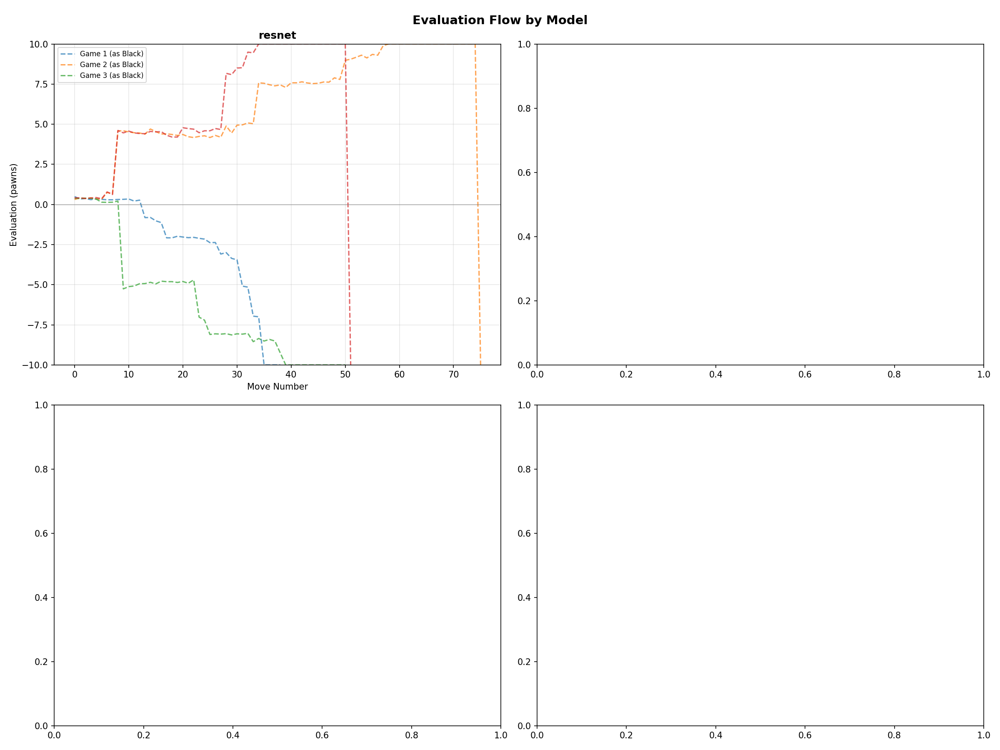
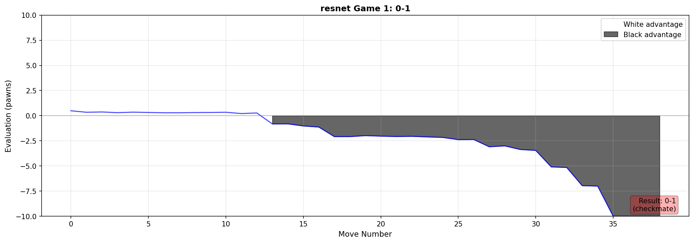
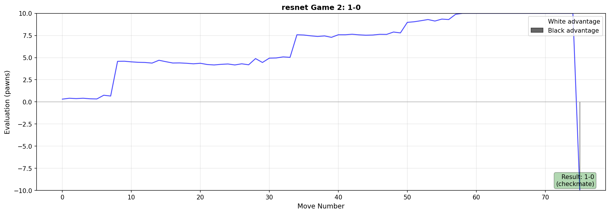
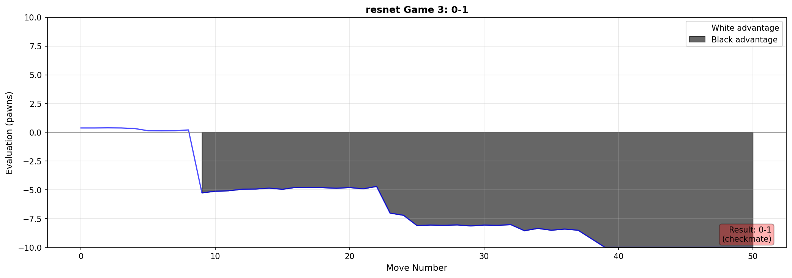
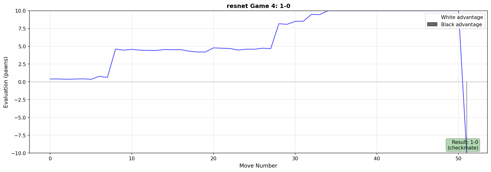

# Detailed Chess Model Benchmark

**Date:** 2026-02-16 00:06
**Opponent:** Stockfish depth 18
**Evaluation Depth:** 18

## Results Summary

| Model | W | D | L | Score |
|-------|---|---|---|-------|
| resnet | 0 | 0 | 4 | 0.0/4 |

## Move Timing — Model

| Model | Avg (s) | Median (s) | Min (s) | Max (s) | Moves |
|-------|---------|------------|---------|---------|-------|
| resnet | 2.743 | 2.883 | 0.086 | 4.241 | 106 |

## Move Timing — Opponent (Stockfish)

| Model | Avg (s) | Median (s) | Min (s) | Max (s) | Moves |
|-------|---------|------------|---------|---------|-------|
| resnet | 0.705 | 0.634 | 0.001 | 3.396 | 108 |

## Game Files

- **Combined PGN:** [all_games.pgn](all_games.pgn) - Open in Lichess, Chess.com, or any chess software
- **Individual PGNs:** `pgn/` directory

## Evaluation Charts

### Individual Game Charts

#### resnet

## How to View Games

1. **Lichess:** Go to lichess.org/paste and paste the PGN content
2. **Chess.com:** Use chess.com/analysis and import PGN
3. **Desktop Apps:** Open with ChessBase, Arena, SCID, or Lucas Chess
4. **Command Line:** Use `python-chess` to parse the PGN files
