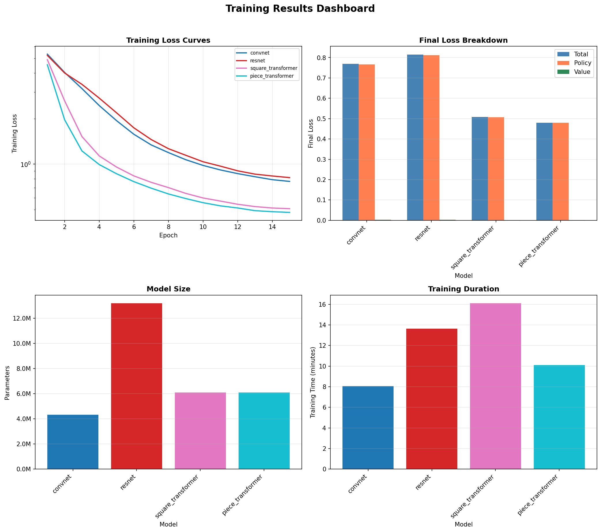

# Chess Model Training Report

**Generated:** 2026-01-26 23:19:28

## Summary

- **Models Trained:** 4
- **Failed:** 2

### Failed Models

- gcn
- gat

## Detailed Results

| Model | Parameters | Final Loss | Policy Loss | Value Loss | Time (min) |
|-------|------------|------------|-------------|------------|------------|
| piece_transformer | 6,102,721 | 0.4800 | 0.4795 | 0.0005 | 10.1 |
| square_transformer | 6,094,785 | 0.5080 | 0.5072 | 0.0008 | 16.1 |
| convnet | 4,328,897 | 0.7694 | 0.7673 | 0.0020 | 8.0 |
| resnet | 13,187,777 | 0.8151 | 0.8126 | 0.0025 | 13.6 |

## Visualizations

### Individual Charts

- [Training Loss Curves](figures/training_loss_curves.png)
- [Policy Loss Curves](figures/policy_loss_curves.png)
- [Value Loss Curves](figures/value_loss_curves.png)
- [Final Losses Comparison](figures/final_losses_comparison.png)
- [Model Parameters](figures/model_parameters.png)
- [Training Time](figures/training_time.png)

## Recommendations

**Best Performing Model:** `piece_transformer`
- Final Loss: 0.4800

### Training Progress Assessment

- **convnet:** Loss still decreasing (6.9% in last 3 epochs). Consider more training.
- **resnet:** Loss still decreasing (5.2% in last 3 epochs). Consider more training.
- **square_transformer:** Moderate improvement (3.1%). May benefit from more epochs.
- **piece_transformer:** Moderate improvement (2.6%). May benefit from more epochs.
